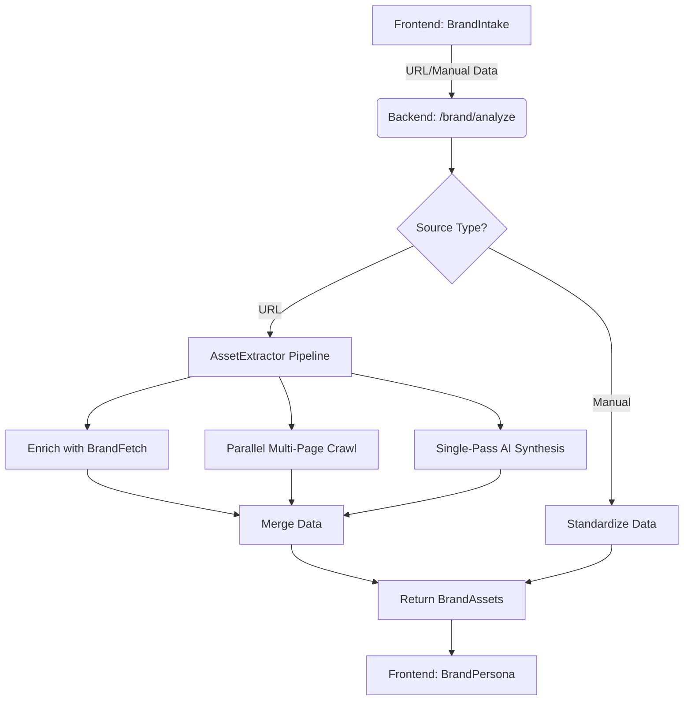

# Brand Extraction: Architecture Overview

The Brand Extraction flow is the entry point for the DIYA experience. It takes a URL or manual input and produces a comprehensive `BrandAssets` object.

## Logic Flow

## Key Components

| Component | Responsibility |
| :--- | :--- |
| `routes.py` | API Entry point; handles request orchestration and stateless response. |
| `ai_scraper.py` | Adapter module that bridges DIYA's sync routes with the async extractor. |
| `asset_extractor.py` | The main engine. Implements the 8-stage extraction/synthesis pipeline. |
| `brand_fetcher.py` | Client for the BrandFetch V2 API. |
| `gemini_service.py` | Interface for Google Gemini (Flash/Pro) models. |

## Data Persistence
This flow is **stateless**. No data is saved to a database on the server. The complete `BrandAssets` object is returned to the client and stored in the React Context (`BrandContext`) for the duration of the session.
